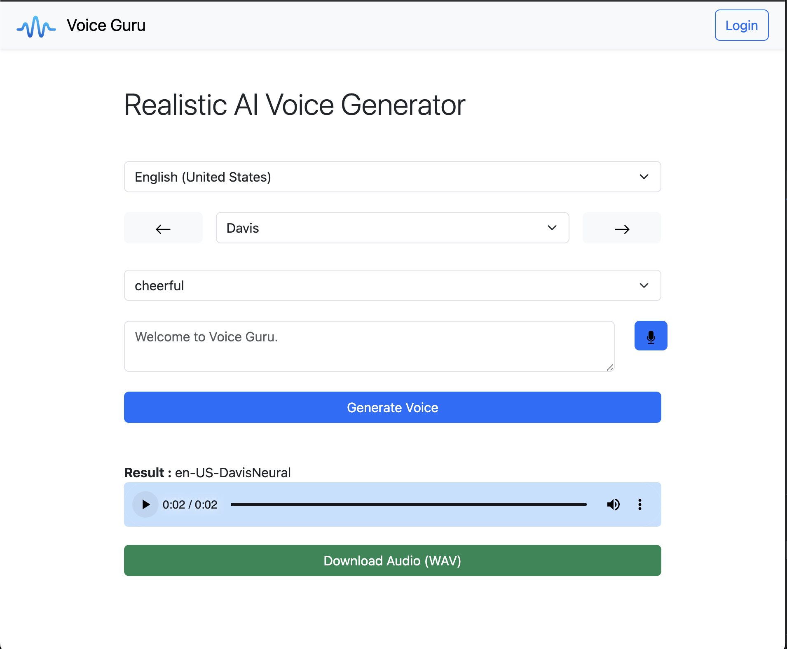

# Voice Guru: Instant AI-Powered Human-Like Voice Generation
Voice Guru is a revolutionary AI-powered service designed to generate human-like voices instantly. Our platform offers an exceptionally user-friendly interface, ensuring a seamless and intuitive experience. Ideal for developers, content creators, and businesses, Voice Guru is at the forefront of digital voice technology.

## Development and Contribution

Our team is dedicated to the ongoing development of Voice Guru. We're currently in the active development phase and welcome contributions from the community. If you're passionate about AI and voice technology, we'd love your input!

Please note that as we're still in the early stages, you might encounter some bugs. Your feedback during this phase is invaluable.

## Technologies Used

This project is built using a variety of modern web technologies and libraries. Contributors should be familiar with:

- **JavaScript**: The primary programming language used.
- **React (v18.2.0)**: For building the user interface.
- **Redux (v4.2.1) and React Redux (v8.1.3)**: For state management.
- **@reduxjs/toolkit (v1.9.7)**: For efficient Redux development.
- **Bootstrap (v5.3.2)**: For styling and responsive design.
- **React Bootstrap Icons (v1.10.3)**: For incorporating Bootstrap icons.
- **React Router Dom (v6.20.0)**: For application routing.
- **Dotenv (v16.3.1)**: For managing environment variables.
- **Microsoft Cognitive Services Speech SDK (v1.33.1)**: For speech processing capabilities.

## Getting Started

To contribute to this project, follow these steps:

1. Clone the repository to your local machine.
2. Run `npm install` to install all the dependencies.
3. Use `npm start` to launch the application locally.
4. To build the project, use `npm run build`.

## Contribution Guidelines

We welcome contributions from the community. Here are some ways you can contribute:

- **Bug Reports**: Report issues and bugs you find.
- **Feature Requests**: Suggest new features or improvements.
- **Pull Requests**: Submit pull requests with bug fixes or new features.

Feel free to contriubte your way!

## Early Interface Preview

Below is a glimpse of the Voice Guru user interface. Our design focuses on simplicity and efficiency, allowing users to interact with the AI voice generation features easily.

